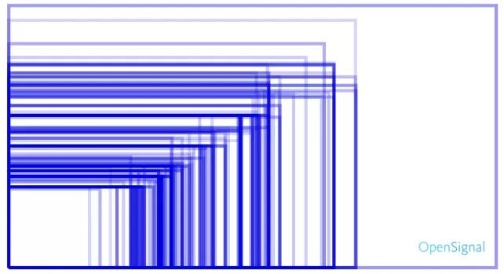

# ScreenAdaptation
One-step screen adaptation.

大家都知道Android屏幕适配是件非常头疼的事，目前全世界安卓设备的大大小小分辨率，大大小小的尺寸，最终形成的设备屏幕大小种类不计其数，但就这一项就给开发者造成了不少困难，总是照顾住这种屏幕照顾不了那种屏幕。

先来放一种很熟悉的图：  


针对Android屏幕适配，除了我们按照“灵活运用布局”、“尺寸限定符”、“布局相关属性”、“.9图”、“屏幕密度适配”等官方标准，但是却发现还远远不够，要么添加很多图片(从加载性能说似乎是必要的)使得apk变得很大，要么有多套布局工作量变大难以维护。针对屏幕适配，google官方也是系统默认支持的是采用屏幕像素密度来进行匹配相关资源和长度的，这一块不做过多的阐述了，建议参看官方文档。

这里我提供一个最牛、最简单、一步到位的方案，大概其优点如下：

- 只需要提供一套最优图片，用于减小apk包大小。当然为了加载性能和图片更精细化显示采用多套也可以。
- 无论大小屏如果布局确定只需要一套布局，当然如果横竖屏变换不同的屏幕展示，多套也是必要的。
- 没有重叠的现象发生，按照默认布局方法可能在大屏上适配很好，到小屏上却出现重叠的现象，很常见，但这里我不允许他有！
- 无论大小屏整体看过去布局几乎相同，因为是按比例来的。
- 在大屏上展示不会随着完全比例放大而显得傻、大、憨。

其原理也很简单，就是根据基准屏幕像素密度来进行适当缩放后得到相对屏幕像素，然后给系统的像素密度重新赋值。

准备工作：
确定一套基准屏幕参数，然后布局时根据这套参数布局，单位仍然采用dp，并尽可能确定其布局控件的长度。
```java
        //绘制页面时参照的设计图尺寸
        final float DESIGN_WIDTH = 1080f;
        final float DESIGN_HEIGHT = 1920f;
        final float DESTGN_INCH = 5.0f;
```

三步走：
1. 确定放大缩小比例
2. 确定参考屏幕密度
3. 确定相对屏幕密度并重新赋值给系统的像素密度

主要方法：
```java
    /**
     * 重置屏幕密度
     */
    public static void resetDensity(Context context) {
        //绘制页面时参照的设计图尺寸
        final float DESIGN_WIDTH = 800f;
        final float DESIGN_HEIGHT = 1280f;
        final float DESTGN_INCH = 5.0f;
        //大屏调节因子，范围0~1，因屏幕同比例放大视图显示非常傻大憨，用于调节感官度
        final float BIG_SCREEN_FACTOR = 0.8f;

        DisplayMetrics dm = context.getResources().getDisplayMetrics();

        //确定放大缩小比率
        float rate = Math.min(dm.widthPixels, dm.heightPixels) / Math.min(DESIGN_WIDTH, DESIGN_HEIGHT);
        //确定参照屏幕密度比率
        float referenceDensity = (float) Math.sqrt(DESIGN_WIDTH * DESIGN_WIDTH + DESIGN_HEIGHT * DESIGN_HEIGHT) / DESTGN_INCH / DisplayMetrics.DENSITY_DEFAULT;
        //确定最终屏幕密度比率
        float relativeDensity = referenceDensity * rate;

        if (ORIGINAL_DENSITY == -1) {
            ORIGINAL_DENSITY = dm.density;
        }
        if (relativeDensity > ORIGINAL_DENSITY) {
            relativeDensity = ORIGINAL_DENSITY + (relativeDensity - ORIGINAL_DENSITY) * BIG_SCREEN_FACTOR;
        }
        dm.density = relativeDensity;
        dm.densityDpi = (int) (relativeDensity * DisplayMetrics.DENSITY_DEFAULT);
        dm.scaledDensity = relativeDensity;
    }
```
上边放大缩小比例是根据屏幕的长宽和参考屏幕的长宽对应设定的，这样计算出来的屏幕密度是固定的。  
注意最终赋值的三个成员变量的含义：
- dm.density  
屏幕密度比率，不同设备的屏幕视图的长宽大小都是根据屏幕密度比率与屏幕密度基准值（160dp）的乘积。此成员变量控制拥有固定长宽值视图的缩放。
- dm.densityDpi  
实际屏幕密度比率，但是单独设定此值并不一定起到缩放效果，需要配合density一起设定，此成员变量控制长宽自动wrapConent形式的缩放，因为wrapContent形式下系统自动为其分配默认的屏幕密度，如果不对其重新赋值，则不能根据规则进行缩放。
- dm.scaledDensity  
独立像素密度，主要处理字体大小缩放，目前比较流行的字体单位为dp，第一能随着应用适应不同的设备缩放，第二避免了跟随系统缩放使得布局展示错乱。但是某些系统机开发者不能控制的例如toast字体大小等默认使用的单位仍然是sp,所以此成员变量也需要进行重新赋值。系统默认应用sp和dp二者的比率为1，但是某些情况下又想根据系统缩放，还要保持整体缩放比率，这是就要系统缩放和应用缩放结合着得出一个比率来最终赋值了。

配置地方：  
DisplayMetrics相关参数的值有两种，一种是默认的，一种是动态调整后的。
获取默认的：
```java
        DisplayMetrics display = new DisplayMetrics();
        getWindowManager().getDefaultDisplay().getMetrics(display);
```
获取动态调整后的：
```java
        DisplayMetrics dm = context.getResources().getDisplayMetrics();
```

应用展示最终使用的DisplayMetrics相关参数就是调整后的。android8.0之前，整个应用长宽缩放比率均是采用一套，所以只需要在Application配置一次即可，但是在Android8.0的时候，系统架构调整，由原来的统一现在分配到每个Activity和全局Application中，Activity中设置的时候要注意一定要设置setContentView()之前，Application的设置即设置在onCreat()即可。为了使这个应用产生效果，建议将Activity形式的配置在BaseActivity中。

Activity中：
```java
    /**
     * 使得在“setContentView()"之前生效，所以配置在此方法中。
     * @param newBase
     */
    @Override
    protected void attachBaseContext(Context newBase) {
        super.attachBaseContext(newBase);
        ScreenUtil.resetDensity(this);
    }

    /**
     * 在某种情况下需要Activity的视图初始完毕Application中DisplayMetrics相关参数才能起效果，例如toast.
     * @param 
     */
    @Override
    public void onAttachedToWindow() {
        super.onAttachedToWindow();
        ScreenUtil.resetDensity(this.getApplicationContext());
    }
```
Application中：
```java
    @Override
    public void onCreate() {
        super.onCreate();
        ScreenUtil.resetDensity(this);
    }
```
这些配置完毕后，一旦app启动优先处理这件事，其他均按照默认处理，就是这么简单。

**使用和不使用截图直观感受**
采用默认布局方式截图对比：  


采用此方案截图对比：  


转载请注明出处，我是toperc.

